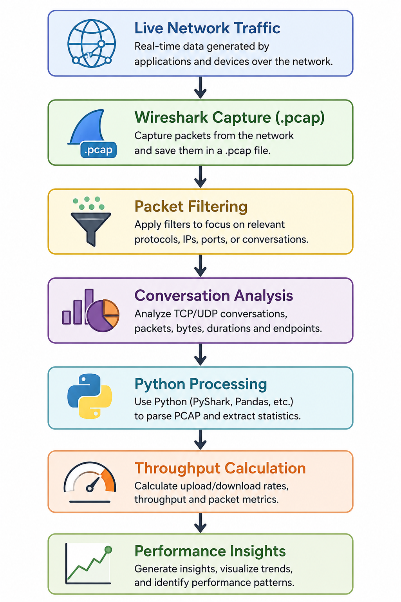

# Network Performance Monitoring & Traffic Analysis using Wireshark

A lightweight network traffic analysis project focused on monitoring network behaviour using Wireshark and Python. This project captures live packet data, extracts traffic statistics, estimates throughput, and studies protocol interactions across TCP/IP communication.

---

## Project Overview

This project was built to understand how modern network communication behaves under actual usage conditions.

Traffic was captured from a Linux machine during normal activities such as:

* GitHub browsing
* GitHub profile switching
* WhatsApp Web usage
* Background OS network communication

The captured PCAP files were analyzed using Wireshark and Python to inspect packet flow, throughput, TCP sessions, retransmissions, and protocol-level interactions.

---

## Features

* Live network traffic capture using Wireshark
* Protocol-level inspection
* TCP conversation analysis
* Throughput estimation from PCAP files
* Upload / download rate calculation
* Packet statistics visualization
* Detection of retransmissions and TCP anomalies
* Analysis across multiple capture sessions

---

## Tech Stack

* Wireshark
* Python
* PyShark
* TCP/IP
* Linux
* Packet Analysis
* Network Monitoring

---

## Concepts Covered

* TCP 3-Way Handshake
* TCP Session Lifecycle
* TLS Communication
* DNS Resolution
* Throughput Analysis
* Packet Retransmission
* Duplicate ACK
* TCP Window Behaviour
* Network Performance Monitoring
* Traffic Flow Analysis

---

## Project Workflow

  

---

## Traffic Analysis Performed

### Protocol Analysis

Observed:

* TCP
* TLS 1.2 / TLS 1.3
* DNS
* HTTP
* SSDP
* ICMPv6

### Conversation Analysis

Measured:

* Session Duration
* Packets Exchanged
* Upload / Download Traffic
* Active Connections
* Top Communication Flows

### Performance Metrics

Calculated:

* Total Packets
* Total Bytes
* Throughput (bps)
* Peak Traffic Windows
* Retransmission Events

---

## Throughput Formula

Throughput was estimated using:

Throughput (bps) =
(Total Bytes × 8) / Time Duration

Example:

735 kB transferred in 28 seconds ≈ 210 kbps

---

## Sample Observations

* Network traffic appeared burst-oriented rather than continuous.
* GitHub traffic produced multiple short TLS sessions.
* Browser activity generated high packet spikes.
* Retransmissions and duplicate ACKs were observed during active communication.
* Traffic remained largely stable with minimal packet loss.

---

## Future Improvements

* Real-time dashboard
* Multi-PCAP batch analysis
* Latency estimation
* Protocol distribution charts
* Alert generation for retransmission spikes
* Web-based visualization

---

## Learning Outcome

This project helped build practical understanding of:

* Packet-level inspection
* Network troubleshooting
* Traffic monitoring
* Performance measurement
* Real-world TCP/IP behaviour
* Basic network optimization concepts

